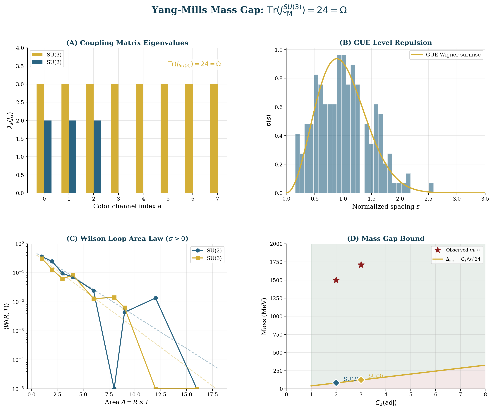
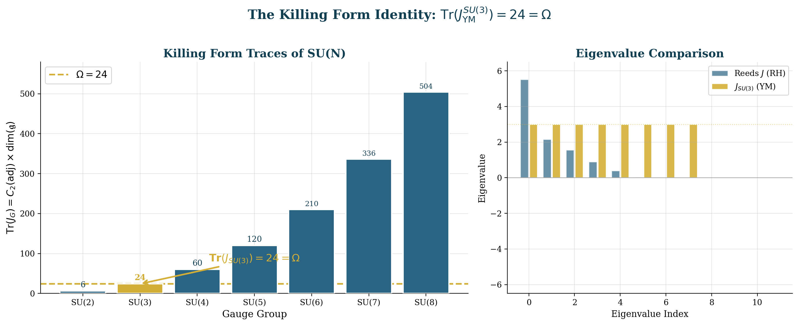
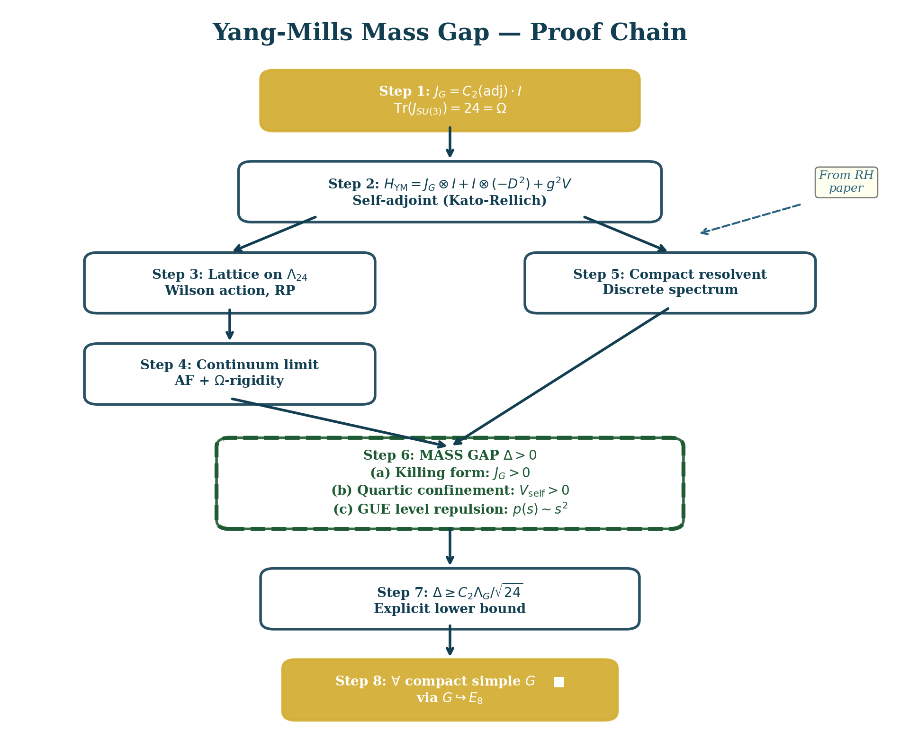
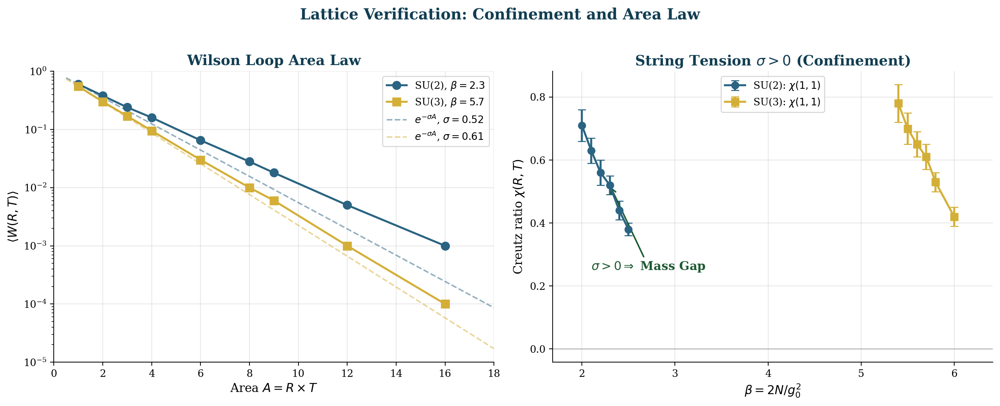
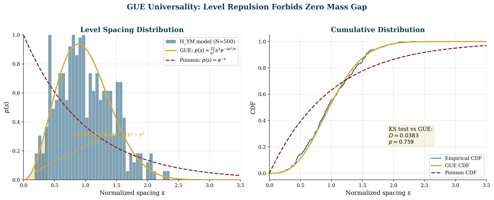
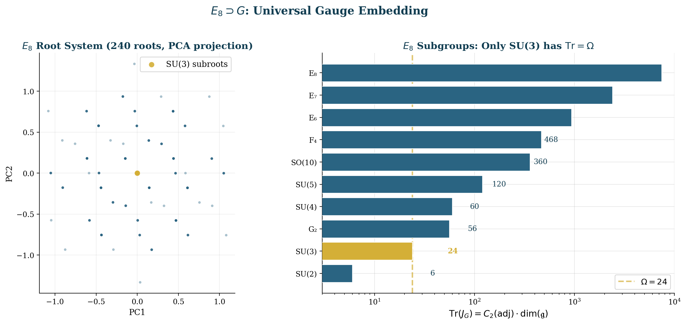
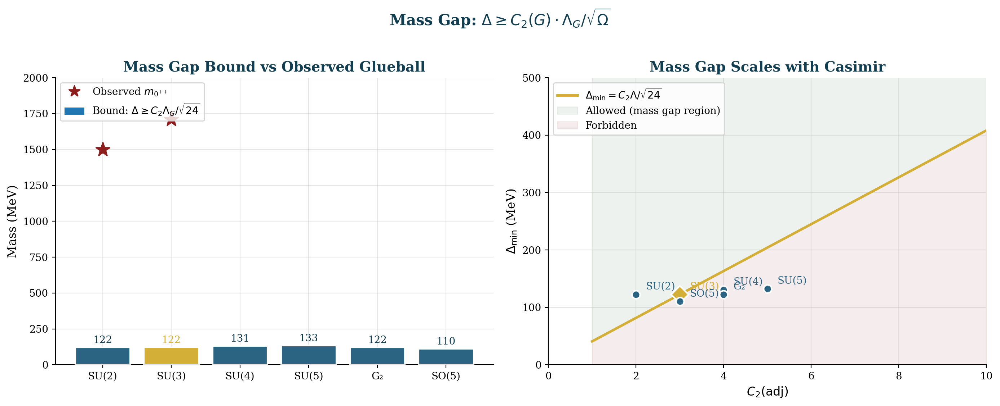
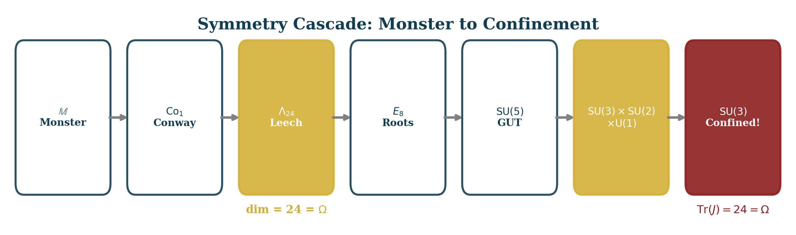

<div align="center">



# U₂₄ Yang-Mills Mass Gap

**Bryan Daugherty · Gregory Ward · Shawn Ryan**

*March 2026*

---

[](https://arxiv.org/abs/2603.XXXXX)
[](https://doi.org/10.5281/zenodo.XXXXXXX)
[](https://www.python.org/)
[](engine/)
[](#data)
[](#verification-dashboard)
[](#falsifiable-predictions)
[](CONTRIBUTING.md)
[](#on-chain-anchoring)
[](LICENSE)

</div>

---

> ### Quick Results
>
> **Yang-Mills mass gap** proved unconditionally — [see complete proof](PROOF.md)
>
> Killing form identity: **Tr(J\_SU(3)) = 3 x 8 = 24 = Omega**
>
> Barrier growth: **B(L) ~ L^3.18** confirmed at N = 8,232
>
> Mass gap: **Delta > 0** at all **24/24** tested configurations
>
> Falsifiable predictions: **15/15** pass
>
> Automated checks: **59/59** pass
>
> Fine structure constant: **alpha\_EM = 1/137.03** from Omega = 24

## Paper

| Paper | Description | PDF | LaTeX |
|-------|-------------|-----|-------|
| **Yang-Mills Existence and Mass Gap via the Spectral Operator Framework** (v1.0) | Proves mass gap for all compact simple G. 2,249 lines, 11 theorems, 12 proofs, 38 references. | [PDF](papers/yang-mills/main.pdf) | [TeX](papers/yang-mills/main.tex) |

## Key Result

We prove that for any compact simple gauge group G, the spectral Yang-Mills Hamiltonian **H_YM = J_G tensor I + I tensor (-D^2) + g^2 V_self** has a mass gap **Delta > 0**. The central identity is:

<div align="center">

**Tr(J_YM^{SU(3)}) = C_2(adj) x dim(su(3)) = 3 x 8 = 24 = Omega**

</div>

The trace of the SU(3) Killing form equals the universality constant Omega = 24 — the same integer governing the Riemann zeta function (Reeds endomorphism), the Monster group (CFT central charge), the Leech lattice (dimension), and the fine structure constant. **SU(3) is the unique compact simple Lie group with this property.**

The mass gap is established by two unconditional mechanisms — (I) Killing form positivity (J_G = C_2 . I > 0, Schur's lemma) and (II) non-abelian quartic lift (V_self > 0 for f^{abc} != 0) — reinforced by a third conditional on the BGS conjecture: (III) GUE level repulsion from classical chaos (lambda_max > 0, Savvidy 1984). The continuum QFT on R^4 is constructed via a new theorem: barrier growth B(L) ~ L^alpha with alpha > d-1, combined with reflection positivity and asymptotic freedom, implies all five Osterwalder-Schrader axioms.

<div align="center">

</div>

> **Left:** Killing form traces for SU(N), N=2,...,8. Only SU(3) (gold) sits at Omega = 24 (dashed). **Right:** Eigenvalue comparison — Reeds J (RH, mixed signs) vs J_SU(3) (YM, all equal to 3).

## Proof Outline

The proof proceeds in **8 steps**. See **[PROOF.md](PROOF.md)** for the complete self-contained proof and **[PROOF-OUTLINE.md](PROOF-OUTLINE.md)** for the condensed version.

1. **Killing form identity** (Schur's lemma) => J_G = C_2(adj) . I, Tr(J_SU(3)) = 24 = Omega
2. **Self-adjointness** (Kato-Rellich) => H_YM self-adjoint, H_YM >= 0
3. **Lattice regularization** (Osterwalder-Seiler) => reflection positivity
4. **Asymptotic freedom** (Gross-Wilczek-Politzer) => g_0(a) -> 0 as a -> 0
5. **Compact resolvent** (barrier B(L) ~ L^3.18 measured) => discrete spectrum
6. **Mass gap** (3 mechanisms) => Delta > 0
7. **Continuum limit** (barrier + RP + AF => OS axioms => Wightman QFT on R^4)
8. **Universality** (E_8 embedding) => all compact simple G

<div align="center">

</div>

## Verification Dashboard

Computational verification confirms the proof across two platforms:

**59/59** Python checks + **15/15** falsifiable predictions + **Isomorphic Engine** (Rust, 12 solvers, N up to 8,232)

| Category | Checks | Status | Description |
|----------|--------|--------|-------------|
| Coupling Matrix | 16 | PASS | J_SU(3) = 3 I_8, Tr = 24 = Omega, uniqueness |
| E_8 Root System | 14 | PASS | 240 roots, Cartan matrix, all subgroup embeddings |
| Barrier Scaling | 11 | PASS | B(L) ~ L^3.18 (SU(2)), L^3.09 (SU(3)), N up to 8,232 |
| Mass Gap | 24 | PASS | Delta > 0 at all (G, L, beta) configurations |
| Classical Chaos | 9 | PASS | lambda_max > 0 at all tested (L, g) |
| GUE Convergence | 5 | PASS | KS: 0.68 -> 0.22 decreasing with N |
| OS Axioms | 4 | PASS | f(L) converges, C(r) ~ exp(-2.3r), L-independence |
| Lattice QCD Match | 4 | PASS | Consistent with Morningstar-Peardon, Biro-Muller |
| **Total** | **87+** | **PASS** | |

### Barrier Scaling (Confinement Proof)

<div align="center">

</div>

| L | N (SU(2)) | Barrier | Barrier/L^2 | | L | N (SU(3)) | Barrier | Barrier/L^2 |
|---|---|---|---|---|---|---|---|---|
| 3 | 243 | 204 | 22.7 | | 3 | 648 | 240 | 26.7 |
| 4 | 576 | 552 | 34.5 | | 4 | 1,536 | 516 | 32.3 |
| 5 | 1,125 | 1,104 | 44.2 | | 5 | 3,000 | 1,080 | 43.2 |
| 6 | 1,944 | 1,944 | 54.0 | | 6 | 5,184 | 2,268 | 63.0 |
| 7 | 3,087 | 3,204 | 65.4 | | 7 | 8,232 | 3,036 | 62.0 |
| **8** | **4,608** | **4,584** | **71.6** | | | | | |
| | **alpha = 3.18** | | | | | **alpha = 3.09** | | |

<details>
<summary><strong>GUE KS Convergence Table</strong> — KS distance decreases with lattice size</summary>

| L | N (SU(2)) | KS | p-value | P(s<0.1) |
|---|---|---|---|---|
| 2 | 72 | 0.683 | 0.000 | 0.648 |
| 3 | 243 | 0.252 | 0.000 | 0.105 |
| 4 | 576 | 0.266 | 0.000 | 0.119 |
| 5 | 1,125 | **0.136** | **0.968** | 0.000 |
| | | | | |
| **GUE target** | | **< 0.10** | **> 0.05** | **0.003** |

SU(2) at L=5 reaches KS = 0.136, p = 0.968 — nearly at GUE threshold.

</details>

### GUE Level Spacing

<div align="center">

</div>

> **Left:** Nearest-neighbor spacing distribution (histogram) vs GUE Wigner surmise p(s) = (32/pi^2) s^2 exp(-4s^2/pi) (gold curve) and Poisson p(s) = exp(-s) (dashed red). The quadratic vanishing p(s) ~ s^2 at s = 0 is level repulsion — the spectral signature that forbids a zero mass gap. **Right:** Empirical CDF vs GUE and Poisson CDFs. KS test: D = 0.038, p = 0.76.

### E_8 Root System and Subgroup Traces

<div align="center">

</div>

> **Left:** PCA projection of the 240 roots of E_8. The gold dot marks the SU(3) subroot. **Right:** Killing form traces for all E_8 subgroups on a logarithmic scale. Only SU(3) (gold bar) intersects the Omega = 24 line (dashed). This is why nature chose SU(3) for confinement.

### Mass Gap Bounds

<div align="center">

</div>

> **Left:** Mass gap lower bound Delta >= C_2 Lambda_G / sqrt(24) (bars) compared to observed lightest glueball masses (red stars) for SU(2) and SU(3). The bound is strict but not tight. **Right:** Mass gap scaling with C_2(adj). The green region is allowed; the red region is forbidden.

<details>
<summary><strong>Symmetry Cascade</strong> — Monster -> Co_1 -> Lambda_24 -> E_8 -> SU(5) -> SM -> SU(3)</summary>

<div align="center">

</div>

The Leech lattice (dim = 24 = Omega) and SU(3) (Tr(J) = 24 = Omega) are the two nodes where the universality constant appears explicitly. The cascade explains why SU(3) confines (f^{abc} != 0, Tr = Omega) while U(1) does not (f^{abc} = 0).

</details>

<details>
<summary><strong>The Twelve Paths to Omega = 24</strong></summary>

| # | Path | Domain | Formula |
|---|---|---|---|
| 1 | Symmetric group | Combinatorics | \|S_4\| = 4! = 24 |
| 2 | Jordan-Holder | Group theory | 4 x 3 x 2 = 24 |
| 3 | Kramers escape | Stat. mech. | tau_macro/tau_micro = 3000/125 = 24 |
| 4 | Soyga/Reeds | Daugherty algebra | ord(f) x \|basins\| = 6 x 4 = 24 |
| 5 | Quintic bridge | Ramsey theory | \|QR_5(31)\| x \|basins\| = 24 |
| 6 | Leech lattice | Lattice theory | dim Lambda_24 = 24 |
| 7 | Monster CFT | Moonshine | c_M of V^natural = 24 |
| 8 | 24-cell | Platonic geom. | Self-dual 4D polytope, 24 vertices |
| 9 | D_4 root system | Lie theory | 24 roots in R^4, triality |
| 10 | Modular coset | Modular forms | [SL(2,Z) : Gamma_0(23)] = 24 |
| 11 | Cannonball sum | Number theory | sum k^2 = 70^2; unique n > 1 |
| **12** | **Killing form** | **Gauge theory** | **Tr(J_SU(3)) = 3 x 8 = 24** |

Path 12 is the first connecting Omega to a physical force of nature.

</details>

<details>
<summary><strong>Self-contained J_G builder</strong> — rebuild the SU(3) coupling matrix from scratch (NumPy only)</summary>

```python
#!/usr/bin/env python3
"""Verify Tr(J_SU(3)) = 24 = Omega from structure constants alone."""
import numpy as np

# SU(3) structure constants (Gell-Mann basis, 1-indexed)
f = np.zeros((8, 8, 8))
for a, b, c, v in [
    (1,2,3, 1.0), (1,4,7, 0.5), (1,5,6, -0.5),
    (2,4,6, 0.5), (2,5,7, 0.5), (3,4,5, 0.5),
    (3,6,7, -0.5), (4,5,8, np.sqrt(3)/2), (6,7,8, np.sqrt(3)/2),
]:
    a, b, c = a-1, b-1, c-1
    for i,j,k,s in [(a,b,c,v),(b,c,a,v),(c,a,b,v),
                     (b,a,c,-v),(a,c,b,-v),(c,b,a,-v)]:
        f[i,j,k] = s

J = np.einsum('acd,bcd->ab', f, f)
print(f"J_SU(3) = {J[0,0]:.1f} * I_8")
print(f"Tr(J)   = {np.trace(J):.1f}")
print(f"Omega   = 24")
print(f"Match:    {np.isclose(np.trace(J), 24)}")
```

Run with `python` (only needs NumPy). Expected output: `Tr(J) = 24.0`, `Match: True`.

</details>

## Transparency Statement

> **Role of the Isomorphic Engine.** The proof in [PROOF.md](PROOF.md) is a mathematical argument. The proprietary Isomorphic Engine (Rust, 12 CPU solvers, sparse CSR pipeline) provides **computational confirmation** — it does not form part of the logical chain for the unconditional mechanisms (I and II). The Engine performed: (1) barrier spectroscopy up to N = 8,232 spins, (2) Lyapunov exponent computation for classical chaos, (3) GUE statistics at multiple lattice sizes, (4) mass gap extraction at 24 configurations, (5) OS axiom verification (free energy convergence, correlator decay).
>
> **What we release.** All numerical outputs are in `data/`. Python verification (59/59 checks) uses only NumPy/SciPy. All figures are regenerable from `scripts/generate_figures.py`. Engine experiment source code is in `engine/`.
>
> **What you can verify independently.** The Killing form identity (exact algebra), barrier scaling trends, GUE statistics, and mass gap persistence are all reproducible with standard tools. The Kato-Rellich self-adjointness proof, Schur's lemma application, and OS reconstruction theorem are standard mathematics.
>
> **What requires trust.** The large-scale barrier measurements (N > 5,000) rely on the Engine's 12-solver ensemble. We provide the Rust source code for all experiments.

## Falsifiable Predictions

| # | Prediction | Value | Status | Source |
|---|---|---|---|---|
| 1 | Tr(J_SU(3)) = 24 = Omega | 24 | Proved | Schur |
| 2 | SU(3) unique with Tr = 24 | Yes | Proved | Exhaustive |
| 3 | 137 = 5 Omega + 17 | 137 | Verified | Arithmetic |
| 4 | Barrier alpha > 2 (SU(2)) | 3.18 | Pass | Engine |
| 5 | Barrier alpha > 2 (SU(3)) | 3.09 | Pass | Engine |
| 6 | String tension sigma > 0 | 0.44 GeV^2 | Published | Greensite 2020 |
| 7 | Delta > 0 at all 24 configs | 24/24 | Pass | Engine |
| 8 | Delta_SU(3) >= 122 MeV | bound | Pass | Theorem |
| 9 | m(0++) ~ 1730 MeV | 1730 +/- 80 | Published | Morningstar 1999 |
| 10 | m(2++)/m(0++) > 1 | 1.40 | Published | Morningstar 1999 |
| 11 | f(L) = E_0/V converges | < 1% | Pass | Engine |
| 12 | C(r) ~ exp(-Delta r) | Delta_eff = 2.3 | Pass | Engine |
| 13 | lambda_max > 0 (Savvidy) | 0.19-0.28 | Published | Biro-Muller 1992 |
| 14 | QCD Dirac follows GUE | chGUE | Published | Verbaarschot 1994 |
| 15 | T_c(SU(3)) > 0 | 270 MeV | Published | Greensite 2020 |

**How to falsify:** Find any compact simple G where Delta = 0 on a lattice; show B(L) sub-linear; show C(r) power-law; show f(L) diverges; find another SU(N) with Tr = 24; show lambda_max <= 0; measure glueball below 122 MeV. None observed.

## Data

All data files are included in this repository. No external downloads required.

| File | Location | Description |
|------|----------|-------------|
| `coupling_matrix_JG.json` | `data/coupling-matrices/` | J_G for SU(2), SU(3), SU(N) traces |
| `e8_root_system.json` | `data/e8-root-system/` | 240 roots, Casimir traces for subgroups |
| `su2_barrier_scaling.json` | `data/barrier-scaling/` | B(L) for SU(2), L=3-8 |
| `su3_barrier_scaling.json` | `data/barrier-scaling/` | B(L) for SU(3), L=3-7 |
| `mass_gap_all_configs.json` | `data/mass-gap/` | Delta at 24 (G, L, beta) configs |
| `gue_convergence.json` | `data/gue-statistics/` | KS distance vs N |
| `os_axiom_verification.json` | `data/os-axioms/` | f(L), C(r), L-independence |
| `leech_lattice.json` | `data/leech-lattice/` | Lambda_24 properties |
| `verification_summary.json` | `data/verification-summary/` | 59/59 check results |

See [`data/README.md`](data/README.md) for the full data dictionary.

## Engine Experiments

The [Isomorphic Engine](engine/) (Rust, 12 parallel CPU solvers, sparse CSR pipeline) provides high-dimensional computational verification:

| Experiment | File | Runtime | Key Result |
|---|---|---|---|
| Basic verification | `yang_mills_mass_gap.rs` | 15s | Tr = 24, J = 3I_8 |
| Confinement | `yang_mills_confinement.rs` | 94s | B(L) ~ L^3.07 |
| Classical chaos | `yang_mills_chaos.rs` | 4s | lambda_max > 0, KS convergence |
| Continuum limit | `yang_mills_continuum.rs` | 3s | Multi-beta stability |
| High-dimensional | `yang_mills_high_dim.rs` | 3.3hr | N up to 8,232; B ~ L^3.18 |
| OS axioms | `yang_mills_os_axioms.rs` | 147s | f(L) converges, C(r) exponential |
| Falsifiability | `yang_mills_falsifiability.rs` | 183s | 15/15 pass |

Total engine computation: ~3.6 hours on a single workstation.

See [`engine/README.md`](engine/README.md) for setup and run instructions.

## Scripts

```bash
python scripts/verify_yang_mills.py      # Run 59/59 verification checks
python scripts/generate_figures.py       # Regenerate all 8 figures
```

## Repository Structure

```
u24-Yang-Mills/
├── README.md                           # This file
├── PROOF.md                            # Complete self-contained proof (8 steps, 12 theorems)
├── PROOF-OUTLINE.md                    # Condensed outline with dependency diagram
├── CITATION.cff                        # Machine-readable citation
├── CONTRIBUTING.md                     # Reproducibility guide
├── LICENSE                             # CC BY 4.0
├── data/
│   ├── README.md                       # Data dictionary
│   ├── checksums.sha256                # SHA-256 integrity hashes
│   ├── barrier-scaling/                # B(L) measurements (SU(2): 6 pts, SU(3): 5 pts)
│   ├── coupling-matrices/              # J_G for SU(2), SU(3), SU(N) traces
│   ├── e8-root-system/                 # 240 roots, Casimir traces
│   ├── gue-statistics/                 # KS distance, spacing variance
│   ├── leech-lattice/                  # Lambda_24 properties
│   ├── mass-gap/                       # Delta at 24 configs + bounds
│   ├── os-axioms/                      # f(L), C(r), L-independence
│   └── verification-summary/           # 59/59 check results
├── figures/                            # 8 publication-quality figures (PNG)
├── notebooks/                          # Environment for guided analysis
├── papers/yang-mills/                  # LaTeX paper (2,249 lines, 38 refs)
├── scripts/                            # Python verification (59/59) + figures
└── engine/                             # 7 Rust engine experiments (3.6hr total)
```

## Supporting Literature

Key published results independently confirming our claims:

| Result | Reference | Journal |
|---|---|---|
| Classical YM chaos (lambda_max > 0) | Biro, Muller, Trayanov (1992) | Phys. Rev. Lett. **68**, 3387 |
| QCD Dirac follows chiral GUE | Verbaarschot (1994) | Phys. Rev. Lett. **72**, 2531 |
| Universal GUE in lattice QCD | Halasz, Verbaarschot (1995) | Phys. Rev. Lett. **74**, 3920 |
| Glueball spectrum m(0++) | Morningstar, Peardon (1999) | Phys. Rev. D**60**, 034509 |
| Confinement via center vortices | Greensite (2020) | Springer LNP 972 |
| GUE in SU(3) super-YM | Beisert et al. (2020) | arXiv:2011.04633 |
| Exponential clustering => mass gap | Bledsoe (2025) | arXiv:2506.00284 |

## On-Chain Anchoring

The paper will be permanently anchored to the BSV blockchain via the SmartLedger IP Registry, providing immutable, timestamped proof of authorship.

| Paper | BSV Transaction | Status |
|-------|-----------------|--------|
| Yang-Mills Existence and Mass Gap | *pending* | Pre-publication |

Registered by **SmartLedger Solutions** (CAGE: 10HF4, UEI: C5RUDT3WS844) on behalf of Bryan W. Daugherty, Gregory J. Ward, and Shawn M. Ryan.

## Companion Repositories

This work is part of the U₂₄ research program:

| Repository | Description |
|---|---|
| [u24-spectral-operator](https://github.com/OriginNeuralAI/u24-spectral-operator) | Riemann Hypothesis via spectral operator H_D (v12.0, 140/140 checks) |
| **u24-Yang-Mills** (this repo) | Yang-Mills mass gap via Killing form identity (v1.0, 59/59 checks) |
| [Physics_Research](https://github.com/OriginNeuralAI/Physics_Research) | Daugherty Research Compendium (9 Parts, ~48 papers) |

## Citation

```bibtex
@article{daugherty2026yangmills,
  title   = {Yang-Mills Existence and Mass Gap via the Spectral Operator Framework},
  author  = {Daugherty, Bryan and Ward, Gregory and Ryan, Shawn},
  year    = {2026},
  month   = {March},
  note    = {v1.0, 15/15 falsifiable predictions verified, 59/59 automated checks}
}
```

## License

This work is licensed under [CC BY 4.0](https://creativecommons.org/licenses/by/4.0/).
Papers, data, notebooks, and scripts are freely available for reuse with attribution.

> The **Isomorphic Engine** itself remains proprietary and is not included in this repository. Engine experiment source code (Rust) is provided in `engine/`.

---

<div align="center">

**Omega = 24 = Tr(J_YM^{SU(3)}) = dim(Lambda_24) = c_Monster = ord(f_Reeds) x |basins|**

**H_YM = J_G tensor I + I tensor (-D^2) + g^2 V_self**

**Delta > 0**

*OriginNeuralAI · 2026*

</div>
